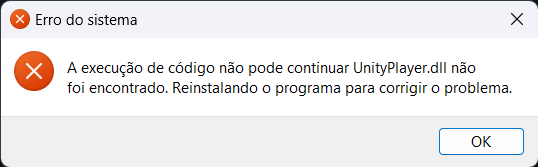

# A execução de código não pode continuar porque UnityPlayer.dll não foi encontrado. Reinstalando o programa para corrigir o problema.

Isso acontece quando o arquivo de DLL do jogo não pode ser encontrado; isso também pode ocorrer caso você não tenha extraído todos os arquivos do jogo e esteja tentando executá-lo diretamente pelo .rar. Se esse for o caso, será necessário extrair o arquivo.

Se isso não funcionar, talvez seja necessário [restaurar o arquivo do Windows Defender](../guides/5.md). 
