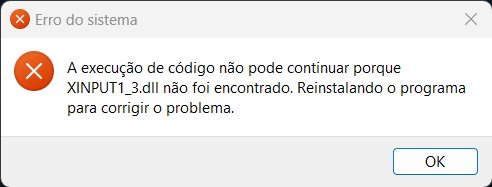

# A execução de código não pode continuar porque XINPUT1_3.dll não foi encontrado. Reinstalando o programa para corrigir o problema.

Instale o [DirectX](../README.md#componentes-necessários) e execute o jogo novamente.
