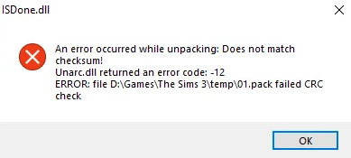

# ISDone.dll - An error occurred while unpacking: Does not match checksum! Unarc.dll returned an error code: -12

Instale o [Microsoft Visual C++ Redistributable](../README.md#componentes-necessários).

Reinicie o computador e execute o instalador novamente.

Se não funcionar, tente [adicionar uma exclusão](../guides/7.md) para a pasta do instalador, e para a pasta em que o jogo está sendo instalado, e em seguida executar o instalador novamente.
