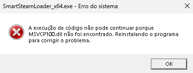
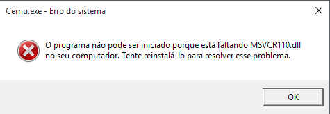
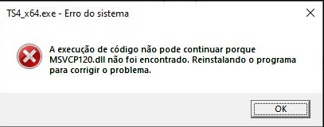
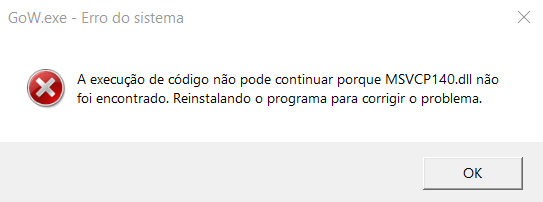

# Erro do sistema - A execução de código não pode continuar porque MSVCR100.dll não foi encontrado. Reinstalando o programa para corrigir o problema.

Instale o [Microsoft Visual C++ Redistributable](../README.md#componentes-necessários).

Reinicie o computador e execute o jogo novamente.
