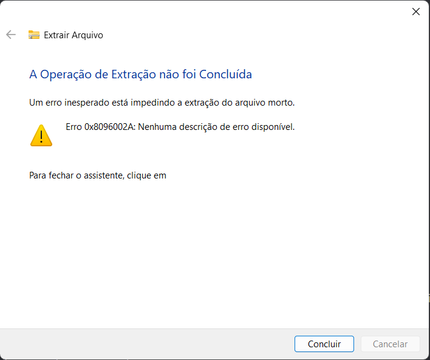

# Erro de Pastas de Arquivo Comprimido - O Windows não consegue abrir a pasta. O suporte para o arquivo encriptado "..." está atualmente indisponível.

Utilize o [WinRAR ou o 7zip](../README.md#componentes-necessários) para abrir este arquivo. Extraia os arquivos do jogo e execute.

