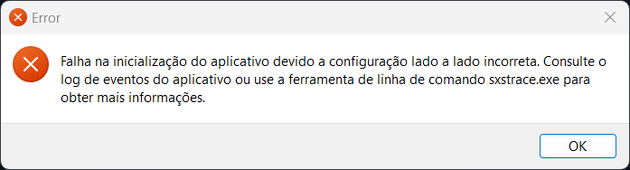

# Falha na inicialização do aplicativo devido a configuração lado a lado incorreta. Consulte o log de eventos do aplicativo ou use a ferramenta de linha de comando sxstrace.exe para obter mais informações.

Instale o [Microsoft Visual C++ Redistributable](../README.md#componentes-necessários).

Reinicie o computador e execute o jogo novamente.
