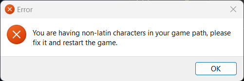

# You are having non-latin characters in your game path, please fix it and restart the game.

Alguma pasta no caminho do jogo possui caracteres que não são da língua inglesa (como acentos ou cedilha).

Isso geralmente acontece caso o nome do seu usuário do Windows possua acentos. Mova o arquivo para um diretório que não possua caracteres especiais no caminho.
