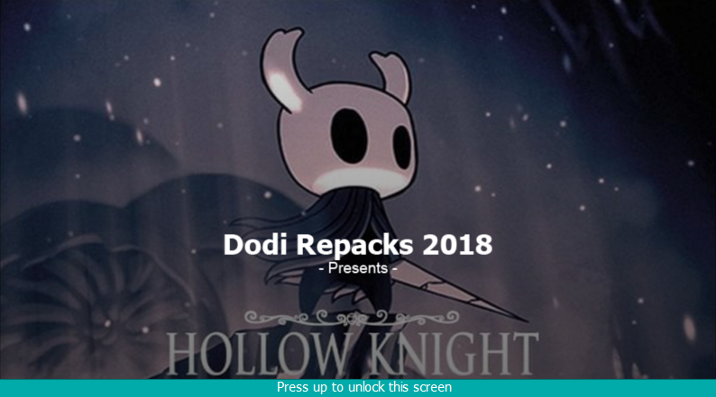

# A instalação está presa em uma imagem com o fundo do jogo com o texto "Press up to unlock this screen".

Esta é a tela inicial para os repacks do DODI. Clique na janela e, em seguida, utilize algum desses métodos para prosseguir na instalação:

1. Pressione a seta para cima no teclado.
2. Pressione a tecla `Fn + W`.
3. Utilize o teclado virtual do Windows para pressionar para cima.
