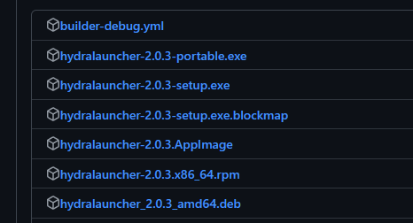
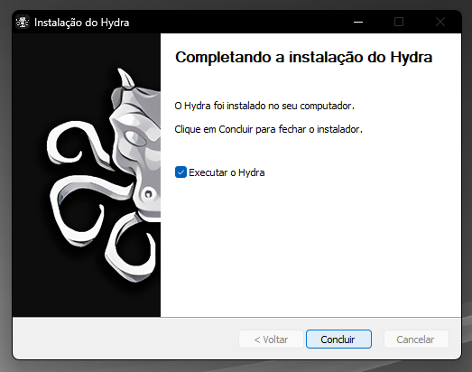

# Como instalar o Hydra Launcher?

A instalação do Hydra pode ser realizada da seguinte maneira:

1. Vá ao [repositório do Hydra no Github](https://github.com/hydralauncher/hydra/releases/) e faça o download da versão setup mais recente

2. Ao baixar, execute o instalador

3. Selecione se o hydra deve estar disponível apenas para você ou para todos usuários do mesmo computador

4. Selecione a pasta de destino

5. Instale e execute o Hydra

6. Com o Hydra aberto, será necessário ter [fontes de download](fontes.md) para que os downloads fiquem disponíveis

