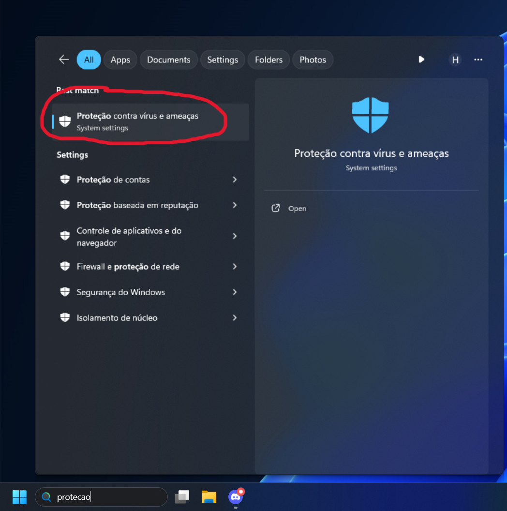
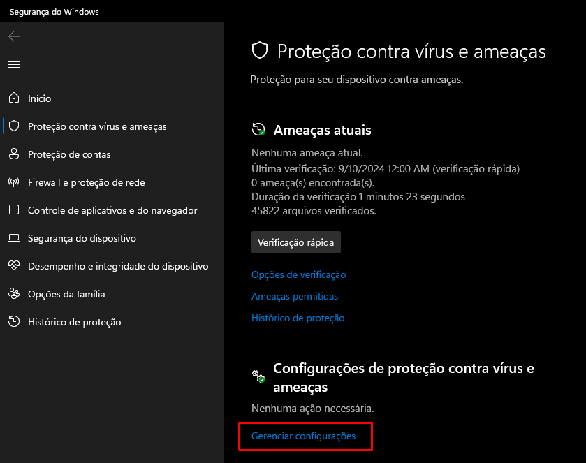
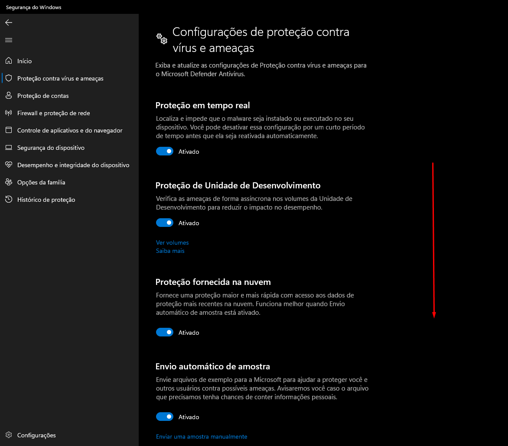
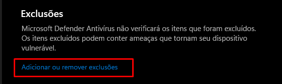
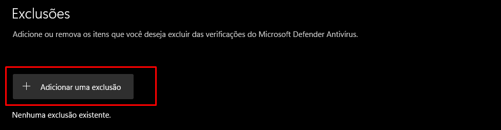
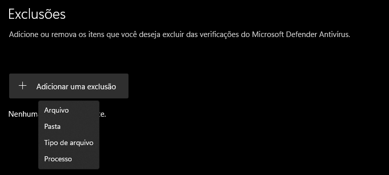

# Como adicionar uma exclusão no Windows Defender?

1. Abra o menu Iniciar e pesquise por "Proteção contra vírus e ameaças"

2. Clique em "Gerenciar Configurações"

3. Role para baixo até achar a opção de "Adicionar ou remover exclusões"

4. Clique no botão "Adicionar uma exclusão", e selecione o arquivo/pasta que desejar

