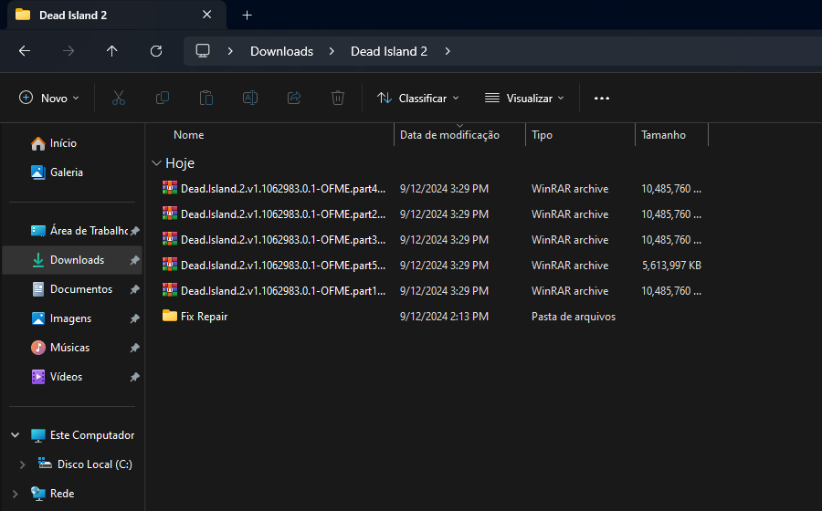
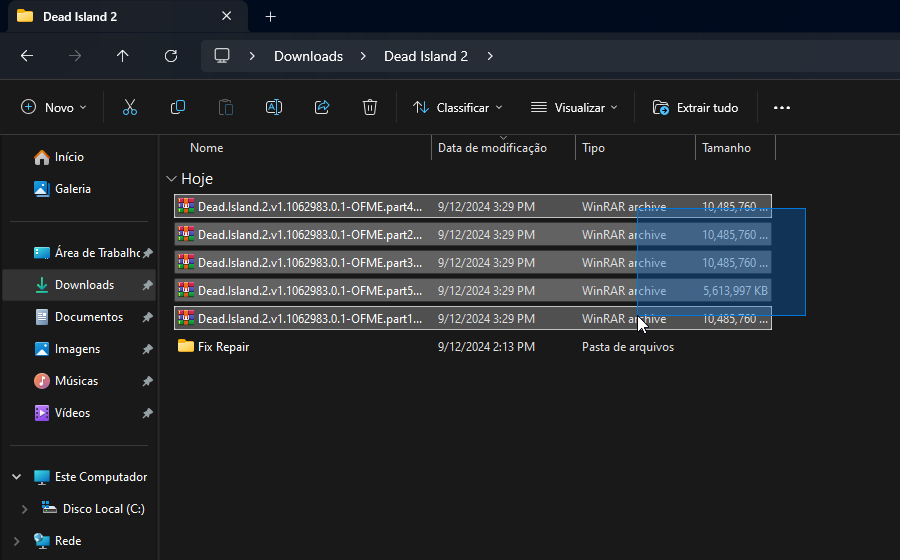
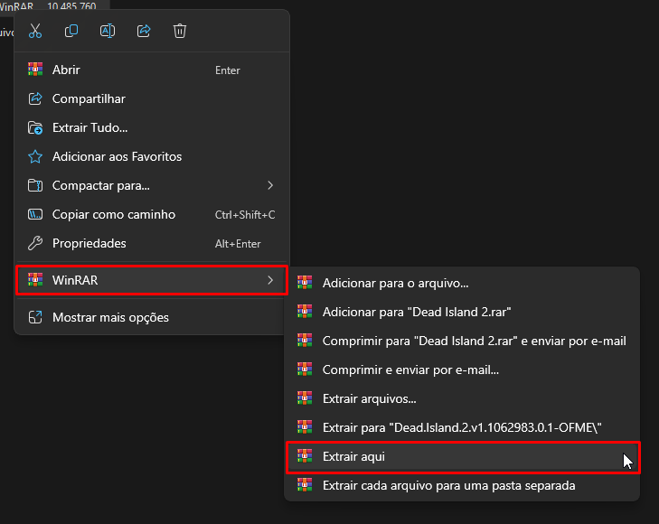
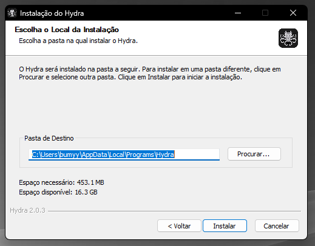

# Como extrair jogos com múltiplas partes?

Em jogos, que são um pouco mais pesados, é comum que venham múltiplos arquivos para serem extraídos, ao invés de apenas um. 

1. Selecione todos os arquivos compactados:

2. Clique com o botão direito, selecione o WinRAR, e selecione a opção para "Extrair aqui":

3. Caso o jogo seja da fonte "Online-fix", digite a senha para extrair:

Pronto! Agora basta esperar a extração ser concluída.
