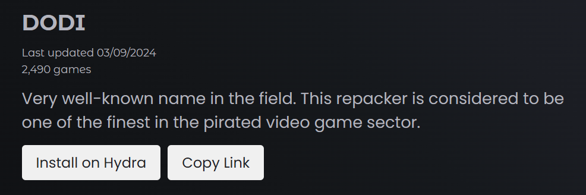
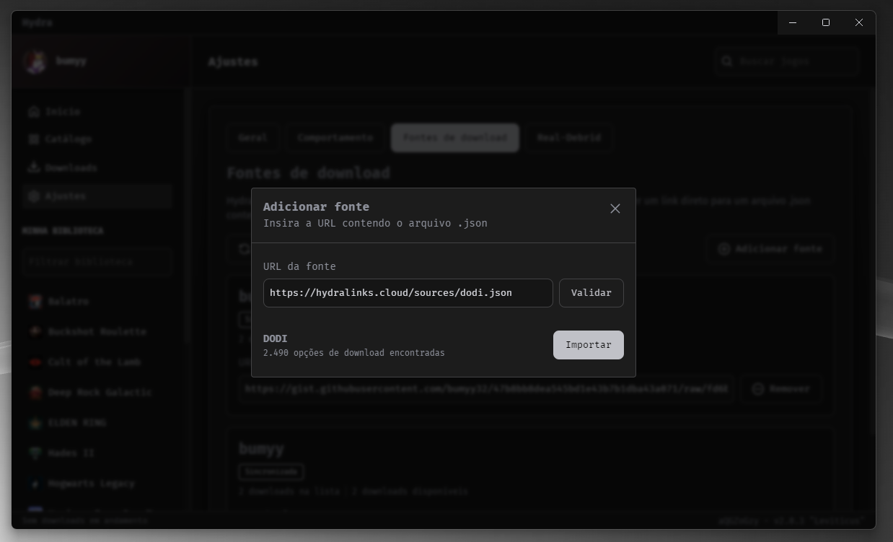
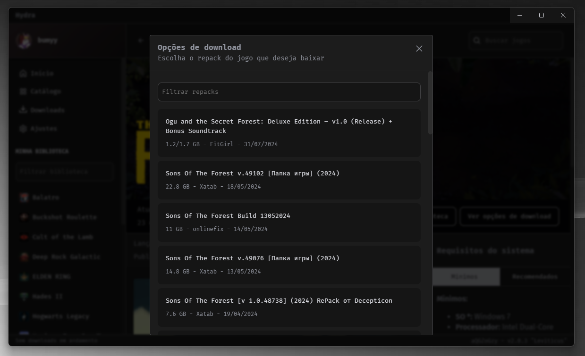
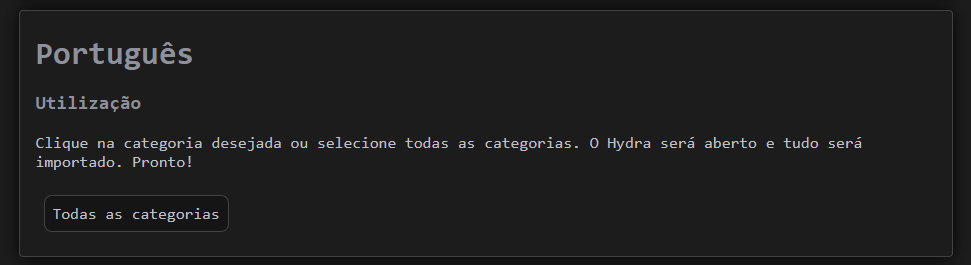
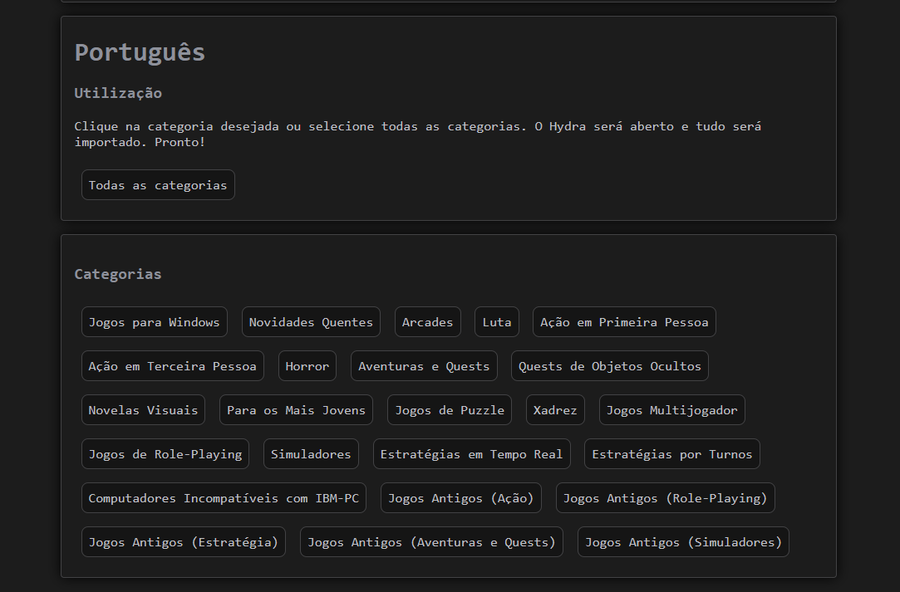

# Como resolver os jogos "Sem downloads disponíveis?"

Para poder realizar downloads no Hydra, será necessário o uso das fontes de download, e você pode instalar elas no seu launcher da seguinte maneira:

## 1. HydraLinks

1.1. Abra o [HydraLinks](https://hydralinks.cloud/)

1.2. Já no site, você deve adicionar cada fonte ao seu launcher usando o botão "Install on Hydra"

1.3. Para instalar, basta clicar na caixa desejada e aceite abrir o Hydra caso algum pop-up apareça na sua tela, como mostrado no print abaixo

1.4. Ao clicar, você será redirecionado para o Hydra, e nele você deve clicar em "Importar"

1.5. Após adicionar as fontes, você estará pronto para usar todas as funcionalidades disponíveis

## 2. RuTracker

2.1. Abra o [RuTracker](https://kekitu.github.io/)

2.2. Já no RuTracker, vá até a seção "Português" no fim da página

2.3. Em português, você pode escolher em instalar todas as categorias que a fonte oferece ou escolher somente as categorias que te agradam

2.4. Para instalar, basta clicar na caixa desejada e aceite abrir o Hydra caso algum pop-up apareça na sua tela, como mostrado no print abaixo

2.5. No Hydra, conclua clicando em "Importar" e está feito

